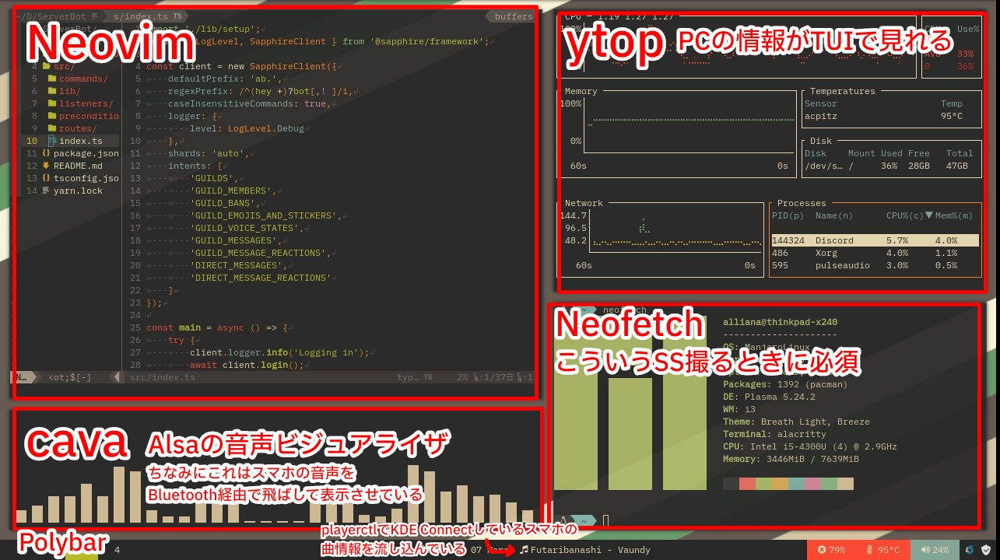

**友人のブログにボツ記事を投げる男，~~スパイダーマ！~~**

ということであさるとの承諾を得てZennに投げるつもりだった記事を投げます。
初めまして，[ありあな](https://twitter.com/Alliana_ab2m)です。

突然ですがタイル型ウィンドウマネージャってかっこいいですよね。しかしそのシンプルさ故に初期設定が結構ハードです。
最初は壁紙はおろか，バッテリーの状況もロクに教えてくれません。

そこでデスクトップ環境であるKDEを先に導入し，ウィンドウマネージャだけをi3wmに置き換えることでKDEとi3wmを共存させます。

メリットは言わずもがな，KDEのリッチなGUIユーティリティ群を使用しながらもi3wmを使用できることや，通知などのインターフェースが粗方組まれている，そして何よりキーボードで全てが操作できるという点です。
デメリットは特に思いつきませんが，強いて言うなら依存パッケージが増えてシステムのシンプルさが損なわれることでしょうか。3日に1回ぐらい`yay -Syyu`したときに鬼のようにアプデがやって来ることがあります。それなりに恐ろしいです。
とはいえ，私はなんだかんだKDEもそれなりの頻度で使うので，そのままにしています。[^1]
２つもデスクトップ環境を抱えるのが嫌な人は，i3wm環境が煮詰まってからKDEを削除しても良いと思います。

[^1]: というより，Manjaroのi3エディションは私の環境ではなぜか不安定だったので，公式フレーバーのKDEを選ぶ他無かった，という結果でもあります。

## 参考にした記事

というかここに書いてある通りに進めればできます。
[heckelson/i3-and-kde-plasma](https://github.com/heckelson/i3-and-kde-plasma)

## 環境

Manjaro KDE Editionを使用します。Debian系であれば，適宜pacmanをaptに置き換えるなどしてください。
他のディストリビューションでもKDEであればおそらく問題ありません。

## 1. i3wm環境に必要なパッケージをインストールする

```
$ sudo pacman -Syyu
$ sudo pacman -S i3-gaps feh i3status
```

`i3-gaps`: i3wm本体です。ウィンドウ間に隙間を生ませるためにi3からフォークされたものです。それ以外の機能はi3と全く変わりません。
`feh`: 壁紙を設定するためのパッケージ
`i3status`: ステータスバーを表示するためのパッケージ

## 2. 初期設定をする

まずはXSessionファイルを作ります。su環境で`/usr/share/xsessions`配下に`plasma-i3.desktop`ファイルを作ってください。
以下のように記述します。
```txt:plasma-i3.desktop
[Desktop Entry]
Type=XSession
Exec=env KDEWM=/usr/bin/i3 /usr/bin/startplasma-x11
DesktopNames=KDE
Name=i3Plasma
Comment=Plasma with i3
```

次にi3wm環境の設定を行います。`i3-config-wizard`を実行してください。
ちなみに実行するターミナルはKDE環境でもi3環境でも問題ありません。
ウィザードに沿って設定を行い，`~/.config/i3/config`が作成されればOKです。

最後にi3wm上でのPlasmaアプリ群の利便性を高めるため，i3wmの設定をします。
`~/.config/i3/config`を開いて以下の内容をコピペしてください。
```
# Plasmaアプリ群の利便性向上
for_window [window_role="pop-up"] floating enable
for_window [window_role="task_dialog"] floating enable

for_window [class="yakuake"] floating enable
for_window [class="systemsettings"] floating enable
for_window [class="plasmashell"] floating enable;
for_window [class="Plasma"] floating enable; border none
for_window [title="plasma-desktop"] floating enable; border none
for_window [title="win7"] floating enable; border none
for_window [class="krunner"] floating enable; border none
for_window [class="Kmix"] floating enable; border none
for_window [class="Klipper"] floating enable; border none
for_window [class="Plasmoidviewer"] floating enable; border none
for_window [class="(?i)*nextcloud*"] floating disable
for_window [class="plasmashell" window_type="notification"] border none, move right 700px, move down 450px
no_focus [class="plasmashell" window_type="notification"]
```

ここまで終わったら，一度ログアウトしてログイン画面(SDDM)に戻り，左下のPlasma(X11)をクリックし，i3Plasmaを選択してログインしてください。

## 3. i3wmを設定する

### ターミナルをKonsoleに変更する

~~共存感を出すために~~KDEに入っているコンソールに置き換えます。
```
# bindsym $mod+Return exec i3-sensible-terminal
bindsym $mod+return exec konsole
```
configファイルの編集を適用するにはWin+Shift+cを入力します。
Winキー+ReturnでKonsoleが起動すれば成功です。

簡単にbindsymに関して説明すると，`bindsym [設定したいキーバインド] [コマンド]`で設定したキーバインドによってコマンドが実行されます。
例えば，`bindsym $mod+F2 exec firefox`と記述した場合，Win+F2でFirefoxが起動します。

### 壁紙を設定する

fehを使います。
```
$ feh /path/to/image
```
すると壁紙にしたい画像が別ウィンドウで表示されると思います。
別ウィンドウ上で右クリックし，File>Background>Set Scaledを選択します。背景が変更されます。
configに
```
exec --no-startup-id ~/.fehbg
```
を書き込むと，起動時に背景が設定されます。

### ウィンドウ間にゆとりを持たせる

今のままでは複数ウィンドウを開いたときにかなり窮屈だと思います。
configに以下の内容を追記します。
```
gaps inner 14
gaps outer -2

smart_gaps on

smart_borders on
```
いい感じに余白が出来ると思います。

## 最後に

i3wmの良さを残しつつも，フォント設定やディスプレイ設定など，CUIから設定が少し難しい部分をKDEシステム設定アプリを使用してGUIから設定できるのはやはり快適です。
**i3wmの世界は沼です。**
どれぐらい沼かと言うと，[日々世界中の人がカスタマイズした自分のデスクトップ環境を貼るreddit](https://www.reddit.com/r/unixporn)があるぐらいには沼です。
ぜひ自分好みのデスクトップ環境に仕上げてみてください。
参考に私の[クソ雑なconfig](https://github.com/Allianaab2m/dotfiles/blob/main/dot_i3/config)と画面構成の一例を置いておきます。

